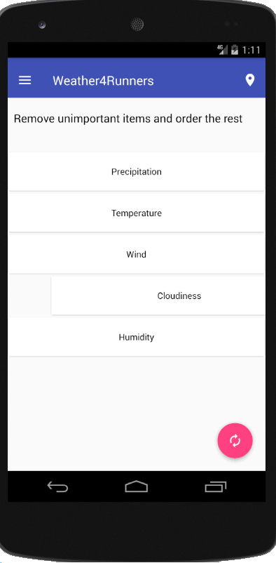
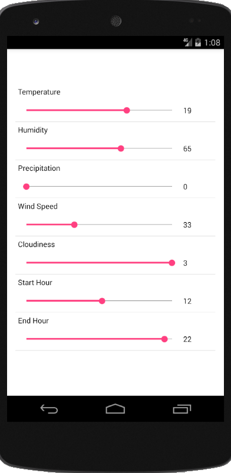
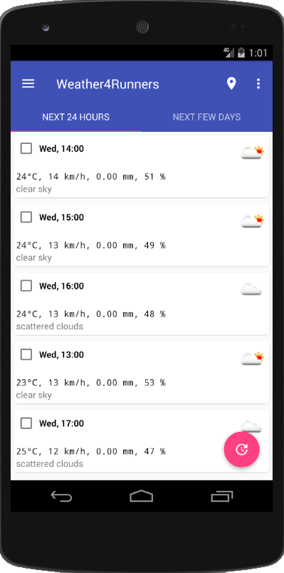
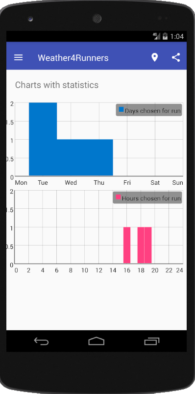

# Weather4Runners

My first Android project done in a group of 2 people during Mobile Apps Development course at Warsaw University of Technology.

The app consumes external Weather API and outputs the best hours (or days) when a user may want to go out for running.
It takes into account user's weather preferences such as: perfect temperature, wind, etc.

